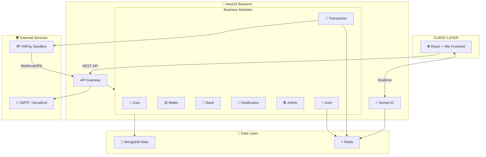
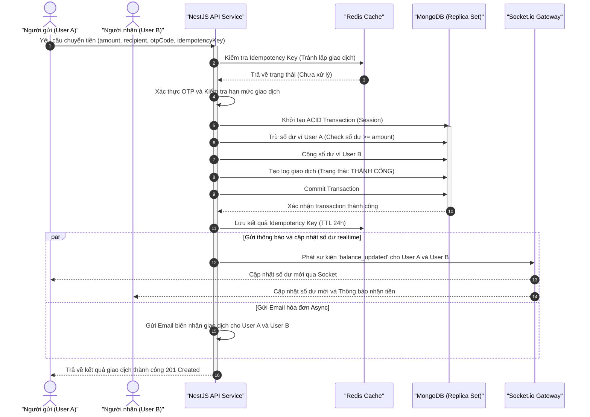

# 🌟 HKi Wallet — Hệ Thống Ví Điện Tử Nội Bộ Toàn Diện (Fintech Simulation Platform)

Một ứng dụng ví điện tử (E-Wallet) nội bộ hiệu năng cao, bảo mật và thời gian thực, được thiết kế theo kiến trúc hiện đại, sẵn sàng cho môi trường sản xuất. Dự án tích hợp đầy đủ các tính năng nạp, rút, chuyển tiền P2P bảo mật giao dịch cao, thanh toán mã QR và hệ thống thông báo realtime.


---

## 📋 Table of Contents

- [Overview](#-overview)
- [System Requirements](#-system-requirements)
- [Environment Variables](#%EF%B8%8F-environment-variables)
- [System Architecture](#-system-architecture)
- [Tech Stack](#-tech-stack)
- [Project Structure](#-project-structure)
- [API Endpoints](#-api-endpoints)
- [Getting Started](#-getting-started)
- [Testing & Verification](#-testing--verification)
- [Conclusion](#-conclusion)

---

## 🎯 Overview

**HKi Wallet** là một nền tảng mô phỏng hệ thống tài chính/ví điện tử (Fintech) đầy đủ từ Backend tới Frontend. Dự án tập trung giải quyết các bài toán kỹ thuật hóc búa của ngành Fintech như **giao dịch ACID an toàn tuyệt đối**, **ngăn chặn giao dịch trùng lặp (Idempotency)**, **bảo mật thông tin nhạy cảm (AES-256)**, **truyền tải dữ liệu thời gian thực (WebSockets)**, và **quy trình phê duyệt kiểm soát nội bộ (Admin Controls)**.

Dự án này là minh chứng rõ ràng cho việc áp dụng các pattern thiết kế tốt nhất trong lập trình Node.js/TypeScript (NestJS) và React, thích hợp làm dự án điểm nhấn trong hồ sơ năng lực (CV) ứng tuyển các vị trí Backend/Fullstack Engineer.

---

## 💻 System Requirements

Để khởi chạy toàn bộ hệ thống dưới local, máy tính của bạn cần đáp ứng các yêu cầu tối thiểu sau:

* **Node.js**: Phiên bản 18.x trở lên (khuyên dùng Node 20.x hoặc 22.x LTS).
* **NPM**: Phiên bản 9.x trở lên (đi kèm với Node.js).
* **Docker & Docker Compose**: Để khởi chạy cơ sở dữ liệu MongoDB và Redis dưới dạng container.
* **Email Client / SMTP Server**: Một tài khoản email hỗ trợ giao thức SMTP (như Gmail App Password) để gửi mã OTP, hoặc sử dụng dịch vụ kiểm thử email mặc định như **Ethereal Mail** được tự động cấu hình sẵn trong mã nguồn.

---

## ⚙️ Environment Variables

Dưới đây là bảng liệt kê toàn bộ các biến môi trường mẫu cần thiết để hệ thống chạy ổn định. Các khóa bảo mật và thông tin nhạy cảm đã được làm mờ (placeholder) bằng giá trị tượng trưng để tránh rò rỉ dữ liệu.

### 1. Backend Environment Variables (`backend/.env`)

| Tên Biến | Giá Trị Mẫu (An Toàn) | Mô tả |
| :--- | :--- | :--- |
| `NODE_ENV` | `development` | Môi trường chạy ứng dụng (`development` hoặc `production`) |
| `PORT` | `3000` | Cổng mạng chạy server NestJS Backend |
| `FRONTEND_URL` | `http://localhost:5173` | URL giao diện Frontend cho phép kết nối CORS |
| `MONGODB_URI` | `mongodb://localhost:27017/hki-wallet` | URI kết nối MongoDB Replica Set (Bắt buộc dùng rs0) |
| `REDIS_URL` | `redis://localhost:6379` | URL kết nối tới bộ nhớ Redis Cache |
| `JWT_ACCESS_SECRET` | `your_short_term_jwt_access_secret_key` | Khóa bí mật ký mã xác thực Access Token |
| `JWT_REFRESH_SECRET` | `your_long_term_jwt_refresh_secret_key` | Khóa bí mật ký mã làm mới Refresh Token |
| `JWT_ACCESS_EXPIRES` | `15m` | Thời gian hết hạn của Access Token |
| `JWT_REFRESH_EXPIRES` | `7d` | Thời gian hết hạn của Refresh Token |
| `COOKIE_SECRET` | `your_cookie_encryption_key` | Khóa mã hóa Cookie an toàn |
| `WEBHOOK_SECRET` | `your_webhook_signature_key` | Khóa đối sánh chữ ký IPN Webhook |
| `QR_HMAC_SECRET` | `your_qr_hmac_hash_key` | Khóa HMAC mã hóa thông tin quét mã QR |
| `SMTP_HOST` | `smtp.gmail.com` | Địa chỉ máy chủ SMTP gửi email OTP |
| `SMTP_PORT` | `587` | Cổng kết nối SMTP (thường là 587 cho TLS) |
| `SMTP_USER` | `your_email@gmail.com` | Email tài khoản gửi thư |
| `SMTP_PASS` | `your_app_specific_password` | Mật khẩu ứng dụng (App Password) sinh từ tài khoản Email |
| `SMTP_FROM` | `HKi Wallet <your_email@gmail.com>` | Nhãn và Email hiển thị ở phần người gửi |
| `VNP_TMN_CODE` | `VNPAY_MERCHANT_CODE` | Mã Merchant do cổng thanh toán VNPay Sandbox cung cấp |
| `VNP_HASH_SECRET` | `VNPAY_SECRET_KEY` | Chuỗi bí mật ký thuật toán SHA512 tạo giao dịch VNPay |
| `VNP_URL` | `https://sandbox.vnpayment.vn/...` | Đường dẫn chuyển hướng thanh toán VNPay Sandbox |
| `VNP_RETURN_URL` | `http://localhost:5173/topup/callback` | Đường dẫn Callback trên UI sau khi thanh toán VNPay xong |

### 2. Frontend Environment Variables (`frontend/.env`)

| Tên Biến | Giá Trị Mẫu (An Toàn) | Mô tả |
| :--- | :--- | :--- |
| `VITE_API_URL` | `http://localhost:3000/api/v1` | URL gốc của cổng RESTful API Backend |
| `VITE_SOCKET_URL` | `http://localhost:3000` | URL kết nối Socket.io Client với Gateway thời gian thực |

---

## 🏗 System Architecture

Kiến trúc hệ thống của **HKi Wallet** được xây dựng theo mô hình Micro-services định hướng (Service-Oriented Architecture):




### Chi tiết các tầng thành phần:
* **Frontend Client:** Ứng dụng Single Page Application (SPA) xây dựng trên nền tảng React và Vite. Sử dụng Tailwind CSS và shadcn/ui để tạo ra giao diện Glassmorphism hiện đại, sang trọng.
* **Backend API Gateway:** Ứng dụng NestJS đóng vai trò nhận, lọc đầu vào (ValidationPipe), kiểm soát phân quyền (Guards) và định tuyến xử lý logic nghiệp vụ.
* **Cache & Memory Store:** Redis đảm nhận vai trò lưu trữ các phiên làm việc tạm thời, OTP có thời hạn (TTL 10 phút), khóa giao dịch (Idempotency Key) và Blacklist Token.
* **Primary Database:** MongoDB Replica Set gồm 3 Node hoạt động song song để kích hoạt tính năng **ACID Transactions** đảm bảo an toàn tài chính.
* **External Integration:** Kết nối hệ thống thư điện tử SMTP để gửi mã OTP, kết nối Cổng thanh toán VNPay qua thuật toán tạo chữ ký bảo mật HMAC-SHA512.

---

## 🛠 Tech Stack

Dưới đây là chi tiết các thư viện cốt lõi được lựa chọn kỹ lưỡng để tối ưu hoá hiệu năng và bảo mật cho hệ thống:

### Backend (NestJS)
* **`@nestjs/mongoose` & `mongoose`**: Quản lý schema dữ liệu MongoDB và thực thi ACID transactions thông qua Mongoose Session.
* **`ioredis`**: Thư viện kết nối Redis tốc độ cao, hỗ trợ pipeline và các tác vụ caching tối ưu.
* **`bcrypt`**: Thuật toán băm một chiều (One-Way Hash) mật khẩu của người dùng kèm muối (Salt Rounds = 12).
* **`passport-jwt`**: Tích hợp các chiến lược (Strategies) xác thực API bảo mật cao bằng Token.
* **`socket.io`**: Quản lý các kênh kết nối WebSockets song công realtime.
* **`class-validator` & `class-transformer`**: Tự động kiểm tra dữ liệu đầu vào (DTO validation) ngăn chặn lỗ hổng SQL/NoSQL Injection.
* **`nodemailer`**: Gửi email biên lai giao dịch và email OTP.
* **`vnpay`**: Thư viện SDK hỗ trợ tạo chuỗi URL và xác thực chữ ký số thanh toán với VNPay.

### Frontend (React + Vite)
* **React 18 & TypeScript**: Xây dựng UI component-based với kiểu dữ liệu chặt chẽ.
* **Redux Toolkit**: Quản lý State toàn cục của ứng dụng (Auth state, User profile, Notification counter).
* **Socket.io-client**: Kết nối và lắng nghe biến động từ máy chủ realtime.
* **Recharts**: Thư viện vẽ biểu đồ phân tích biến động dòng tiền cho giao diện Admin.
* **TailwindCSS & Lucide Icons**: Thiết kế UI nhanh, mượt mà và tối giản.

---

## 📂 Project Structure

```
e-wallet/
├── backend/                    # NestJS Backend Application
│   ├── src/
│   │   ├── common/             # Bộ lọc lỗi, guards bảo mật, decorators dùng chung
│   │   │   ├── decorators/     # Decorator lấy thông tin User đăng nhập
│   │   │   ├── filters/        # Bộ lọc Exception toàn cục (AllExceptionsFilter)
│   │   │   ├── guards/         # Guard bảo mật JWT và phân quyền Admin/User
│   │   │   └── mailer/         # Service gửi email OTP & biên lai
│   │   ├── gateways/           # Socket.io Gateway kết nối realtime
│   │   ├── modules/            # Các module nghiệp vụ chính của hệ thống
│   │   │   ├── admin/          # Quản lý người dùng, duyệt rút tiền, cài hạn mức
│   │   │   ├── auth/           # Đăng ký, đăng nhập, quên mật khẩu, quản lý OTP
│   │   │   ├── bank/           # Liên kết thẻ ngân hàng & Mã hóa dữ liệu
│   │   │   ├── transactions/   # Logic chuyển tiền, nạp tiền VNPay, lịch sử giao dịch
│   │   │   ├── users/          # Quản lý hồ sơ cá nhân và thông tin người dùng
│   │   │   └── wallets/        # Quản lý số dư, xử lý nghiệp vụ nạp/rút/chuyển
│   │   └── main.ts             # File khởi chạy server cấu hình Cors, Helmet, Prefix
│   ├── test/                   # Thư mục chứa các kịch bản kiểm thử tự động e2e
│   ├── tsconfig.json           # Cấu hình TypeScript của Backend
│   └── package.json            # Quản lý thư viện phụ thuộc của Backend
│
├── frontend/                   # React Frontend Application
│   ├── src/
│   │   ├── components/         # Các Component giao diện tái sử dụng (Button, Input, Layout)
│   │   ├── context/            # Quản lý Context API (AuthContext, SocketContext)
│   │   ├── features/           # Các trang và tính năng nghiệp vụ giao diện
│   │   │   ├── admin/          # Trang quản trị Admin Dashboard
│   │   │   ├── auth/           # Giao diện Đăng ký, Đăng nhập, OTP
│   │   │   ├── dashboard/      # Giao diện tổng quan ví của User
│   │   │   ├── transactions/   # Lịch sử biến động số dư & Chuyển tiền
│   │   │   └── wallets/        # Nạp/Rút tiền & Liên kết ngân hàng
│   │   └── App.tsx             # Khởi tạo React Routes bảo vệ (Protected Routes)
│
├── docs/                       # Tài liệu nghiệp vụ & sơ đồ luồng dữ liệu
└── scripts/                    # Scripts tự động dọn dẹp và seed dữ liệu test nhanh
```

---

## 📡 API Endpoints

Dưới đây là bảng thông tin chi tiết về các API chính trong hệ thống:

### 1. 🔑 Hệ Thống Xác Thực & Người Dùng (`/api/v1/auth`)

| Phương thức | Endpoint | Yêu cầu Auth | Mô tả | Dữ liệu đầu vào (Payload) |
| :---: | :--- | :---: | :--- | :--- |
| `POST` | `/register` | Không | Đăng ký tài khoản người dùng mới | `{ email, phone, fullName, password }` |
| `POST` | `/verify-otp` | Không | Xác thực mã OTP kích hoạt tài khoản | `{ email, code }` |
| `POST` | `/resend-otp` | Không | Gửi lại mã OTP qua Email | `{ email }` |
| `POST` | `/login` | Không | Đăng nhập hệ thống (Lưu HttpOnly Cookie) | `{ email, password }` |
| `POST` | `/refresh-token` | Không | Lấy Access Token mới bằng Refresh Token | Không |
| `POST` | `/logout` | Có | Đăng xuất và khóa token | Không |
| `POST` | `/forgot-password` | Không | Yêu cầu gửi mã OTP khôi phục mật khẩu | `{ email }` |
| `POST` | `/reset-password` | Không | Đặt mật khẩu mới bằng OTP | `{ email, code, newPassword }` |

### 💳 2. Giao Dịch & Quản Lý Ví (`/api/v1/transactions` và `/api/v1/wallets`)

| Phương thức | Endpoint | Yêu cầu Auth | Mô tả | Dữ liệu đầu vào / Tham số |
| :---: | :--- | :---: | :--- | :--- |
| `GET` | `/transactions` | Có | Lấy danh sách lịch sử giao dịch (Phân trang) | `Query: page, limit, type, status` |
| `GET` | `/transactions/:id` | Có | Lấy chi tiết lịch sử một giao dịch | Tham số `:id` trên URL |
| `POST` | `/transactions/deposit` | Có | Khởi tạo giao dịch nạp tiền qua cổng VNPay | `{ amount, description }` |
| `POST` | `/transactions/withdraw` | Có | Yêu cầu rút tiền về ngân hàng liên kết | `{ amount, description }` |
| `POST` | `/transactions/bank-transfer` | Có | Thực hiện chuyển tiền P2P nội bộ | `{ recipient, amount, description, otpCode }` |
| `POST` | `/transactions/qr-payment` | Có | Thanh toán thông qua chuỗi dữ liệu mã QR | `{ walletId, qrData, amount }` |

### 🛡 3. Phân Hệ Quản Trị Quản Lý (`/api/v1/admin`)

| Phương thức | Endpoint | Quyền (Role) | Mô tả | Dữ liệu đầu vào (Payload) |
| :---: | :--- | :---: | :--- | :--- |
| `GET` | `/admin/users` | Admin | Lấy danh sách tất cả các ví người dùng | `Query: page, limit` |
| `PATCH` | `/admin/users/:id/limit` | Admin | Cài đặt hạn mức giao dịch cho User | `{ limitAmount }` |
| `PATCH` | `/admin/users/:id/status` | Admin | Khóa (Lock) hoặc Mở khóa (Active) tài khoản | `{ status }` |
| `GET` | `/admin/withdrawals` | Admin | Lấy danh sách yêu cầu rút tiền đang chờ | Không |
| `POST` | `/admin/withdrawals/:id/approve`| Admin | Phê duyệt lệnh rút tiền (Thực trừ tiền) | Không |
| `POST` | `/admin/withdrawals/:id/reject` | Admin | Từ chối lệnh rút tiền (Hoàn trả tiền ví) | Không |

---

## 🚀 Getting Started

### 📦 Bước 1: Khởi động Hạ tầng Docker (MongoDB + Redis)
Hệ thống sử dụng MongoDB Replica Set để hỗ trợ ACID Transactions. Hãy khởi động hạ tầng bằng lệnh sau tại thư mục gốc:
```bash
docker compose up -d
```
*Lưu ý:* Vui lòng đợi khoảng **30 giây** trong lần khởi chạy đầu tiên để MongoDB tự động cấu hình replica set `rs0` thành công.

---

### 💻 Bước 2: Cài đặt và chạy Backend (NestJS)
1. Truy cập vào thư mục `backend`:
   ```bash
   cd backend
   ```
2. Tạo cấu hình môi trường `.env`:
   ```bash
   cp .env.example .env
   ```
3. Cài đặt các thư viện và chạy chế độ Development:
   ```bash
   npm install
   npm run start:dev
   ```
* Máy chủ API Backend: `http://localhost:3000/api/v1`
* Tài liệu tương tác API Swagger: `http://localhost:3000/api/docs`

---

### 💾 Bước 3: Khởi tạo Dữ liệu Thử nghiệm (Seeding Database)
Trong khi Backend đang chạy, mở một cửa sổ Terminal mới trong thư mục `backend` và chạy lệnh sau để tự động tạo dữ liệu mẫu:
```bash
npm run seed
```

**Tài khoản Test sẵn có:**

| Email tài khoản | Mật khẩu | Phân quyền (Role) | Chức năng thử nghiệm |
| :--- | :--- | :--- | :--- |
| `admin@hki-wallet.dev` | `Admin@123456` | **Admin** | Đăng nhập để duyệt các giao dịch rút tiền và quản lý người dùng |
| `usera@hki-wallet.dev` | `User@123456` | **User** | Người dùng A (Ví có sẵn 10.000.000đ để chuyển khoản, nạp/rút) |
| `userb@hki-wallet.dev` | `User@123456` | **User** | Người dùng B (Ví trống để nhận chuyển khoản từ người dùng A) |

---

### 🎨 Bước 4: Cài đặt và chạy Frontend (React + Vite)
1. Mở Terminal mới và truy cập vào thư mục `frontend`:
   ```bash
   cd frontend
   ```
2. Tạo cấu hình môi trường `.env`:
   ```bash
   cp .env.example .env
   ```
3. Cài đặt các gói thư viện và khởi động Client:
   ```bash
   npm install
   npm run dev
   ```
* Địa chỉ truy cập Client: `http://localhost:5173`

---

## 🔄 Quy trình nghiệp vụ chuyển tiền P2P (P2P Transfer Sequence)

Dưới đây là sơ đồ chuỗi các sự kiện xảy ra khi thực hiện một giao dịch chuyển tiền giữa 2 người dùng trong hệ thống ví:



---

## 🧪 Testing & Verification

Dự án chú trọng vào chất lượng mã nguồn thông qua việc viết các bài kiểm thử tự động (Automated Testing) cũng như các kịch bản kiểm thử thủ công (Manual Testing) cho các case tài chính phức tạp:

### 1. Kiểm thử tự động (Automated Tests)
Hệ thống tích hợp sẵn kịch bản kiểm thử End-to-End (e2e) để giả lập toàn bộ hành trình gọi API thực tế.
Chạy test e2e từ thư mục `backend/`:
```bash
npm run test:e2e
```
*Kịch bản test e2e bao gồm:*
* Khởi tạo NestJS Application trong môi trường giả lập.
* Thực hiện gọi API `/api/v1/health` để kiểm tra độ sẵn sàng của database và hệ thống.

---

### 2. Kịch bản kiểm thử thủ công Fintech (Fintech Manual Verification Scenarios)

Để chứng minh hệ thống hoạt động ổn định trước nhà tuyển dụng, bạn có thể thực hiện kiểm thử các kịch bản thực tế sau:

#### Scenario A: Kiểm tra ACID Transaction (Tính toàn vẹn số dư)
1. Đăng nhập tài khoản `usera@hki-wallet.dev`.
2. Thực hiện chuyển tiền cho `userb@hki-wallet.dev`.
3. Giả lập lỗi hệ thống xảy ra tại Backend (ví dụ: tắt kết nối MongoDB đột ngột ở giữa quá trình trừ tiền User A).
4. **Kết quả mong đợi:** Số dư ví User A hoàn toàn không thay đổi (giao dịch tự động rollback), và lịch sử không ghi nhận giao dịch thành công. Tiền không bị "bốc hơi" khỏi hệ thống.

#### Scenario B: Kiểm tra chống double-spending (Idempotency Key)
1. Sử dụng công cụ Postman gửi một request chuyển tiền từ User A sang User B với Header `x-idempotency-key: transfer-key-123`.
2. Ngay lập tức gửi lại liên tiếp request tương tự với cùng một key đó.
3. **Kết quả mong đợi:** Hệ thống chỉ trừ tiền của User A **duy nhất một lần**. Request đầu tiên trả về giao dịch thành công. Request thứ hai trả về ngay kết quả đã được lưu trong Redis mà không thực hiện trừ thêm tiền của User A.

#### Scenario C: Hạn mức giao dịch và Xác thực OTP bảo mật
1. Thực hiện lệnh chuyển số tiền **dưới 5.000.000đ**: Hệ thống xử lý thành công ngay lập tức không cần mã OTP.
2. Thực hiện lệnh chuyển số tiền **trên 5.000.000đ**: Hệ thống chặn lại và yêu cầu người dùng gửi mã OTP. Hệ thống sẽ sinh mã OTP gửi về Email của User A. Chỉ khi nhập đúng mã OTP lấy từ email, giao dịch mới được thực thi.
3. Cố tình nhập sai mã OTP: Hệ thống báo lỗi và khóa giao dịch.

---

## 📝 Conclusion

**HKi Wallet** được xây dựng không chỉ là một dự án ứng dụng ví đơn giản, mà là sự thực hành nghiêm túc về mặt kiến trúc phần mềm, bảo mật thông tin và giải pháp kỹ thuật đáp ứng các yêu cầu khắt khe của hệ thống Fintech thực tế. 

Dự án thể hiện đầy đủ các kỹ năng quan trọng của một kỹ sư phần mềm: thiết kế API khoa học, làm chủ hệ thống cơ sở dữ liệu phi quan hệ với giao dịch an toàn (MongoDB Session), sử dụng bộ nhớ đệm cache hiệu quả (Redis), triển khai thời gian thực (Socket.io) và tổ chức mã nguồn sạch sẽ, dễ bảo trì theo chuẩn NestJS. Đây chắc chắn là một mảnh ghép đắt giá trên hành trình chinh phục nhà tuyển dụng của bạn.

---

## 👥 Tác giả (Author)

* **Phát triển bởi:** [Vân Minh](https://github.com/VanMinh2410)
* **GitHub Project:** [e-wallet](https://github.com/VanMinh2410/e-wallet)

Cảm ơn các bạn đã xem dự án! Nếu thấy hữu ích, hãy để lại cho dự án một 🌟 Star nhé!

*Trân trọng cảm ơn!*
